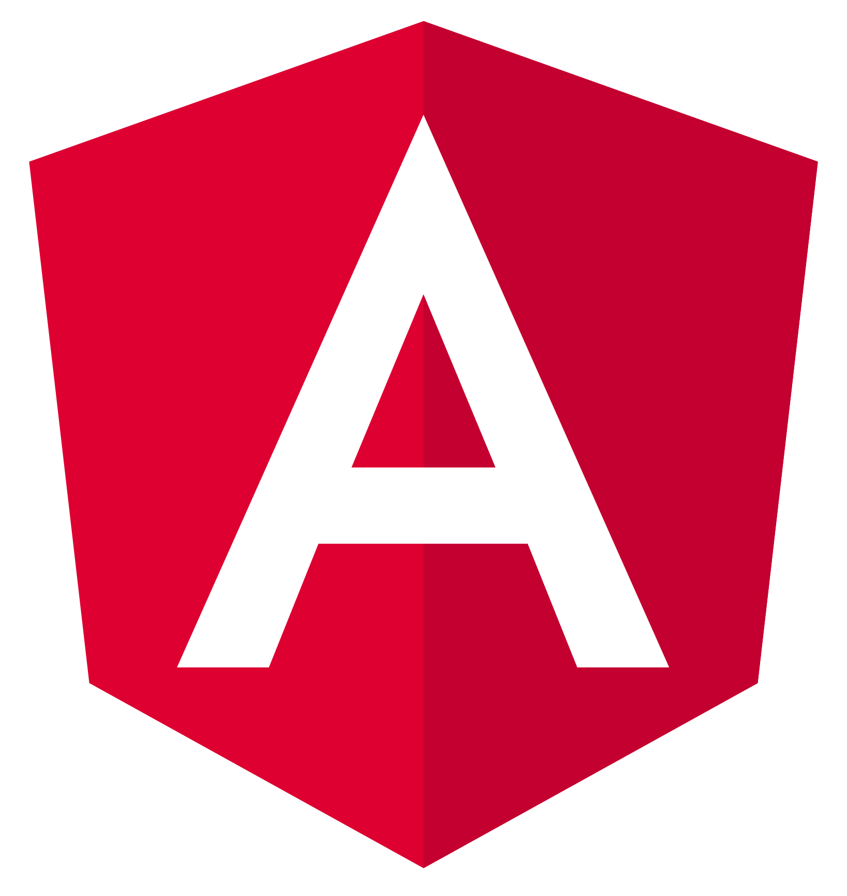
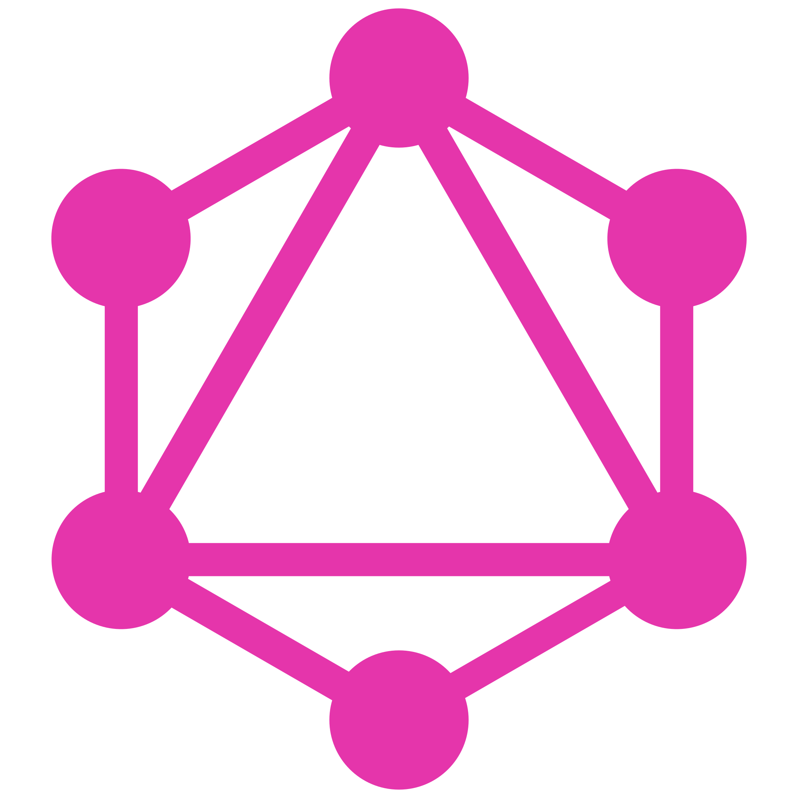

### Hi there 👋

Greetings! I'm Alan, a passionate and results-driven Software Engineer with a proven track record of over 6 years in the dynamic realms of banking, logistics, insurance, and e-commerce industries. My journey in the tech world has been marked by a relentless pursuit of excellence and a commitment to driving impactful changes through cutting-edge software solutions.

### 🌐 Technical Expertise:
My proficiency spans across the entire software development lifecycle, from conceptualization to deployment. I specialize in designing and implementing robust, scalable, and efficient software systems. My technical toolkit includes expertise in languages such as C#, Python, and JavaScript, coupled with a deep understanding of cloud computing, microservices architecture, and DevOps practices.

### 📈 Continuous Learner:
In the ever-evolving tech landscape, I am committed to staying at the forefront of emerging technologies. I actively seek opportunities for professional development and am passionate about sharing knowledge with my peers.

- 🌱 I’m currently learning Elixir 
- 👯 I’m looking to collaborate on indie game development and compilers optimization
- 💬 Ask me about Whatever you want, if I don't know the answer, I'll come up with something
- 📫 How to reach me: On [Linkedin](https://www.linkedin.com/in/alan-g-8b0278114/)
- 😄 Pronouns: Him/His
- ⚡ Fun fact: Love photography

## My tech stack:

### Frontend

### Backend

### Databases

### Cloud Providers

